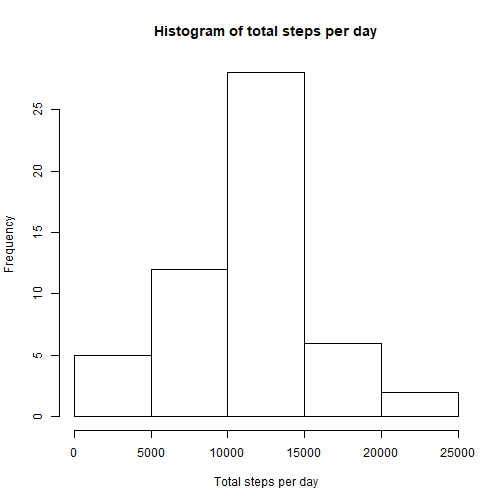
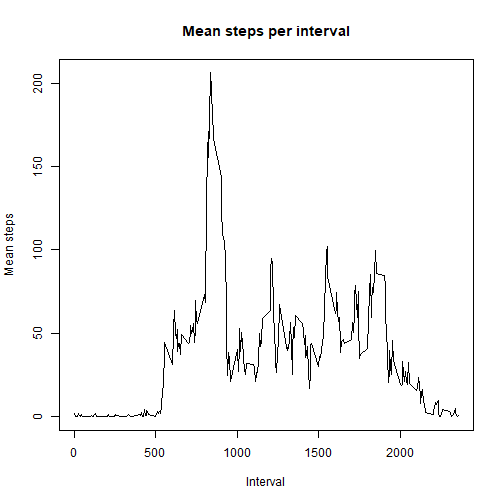
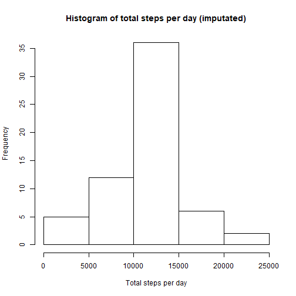
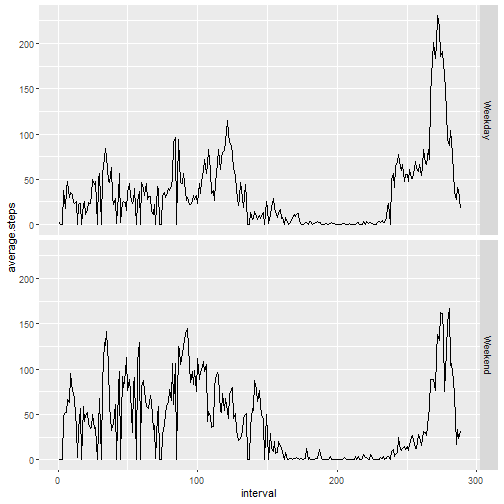

Reproducible Research Course Project 1
======================================

This markdown file includes the R code and output for the first Course Project. The report is divided into five sections to answer the project questions.


### Part 1: Loading and Preprocessing the Data

Here the data is downloaded from the csv file. The date variable is converted from a factor variable to a date format variable and the .


```r
activity <- read.csv("activity.csv")
activity$date <- as.Date(activity$date)
```

### Part 2: What is the mean total number of steps taken each day?

First, let's calculate the total number of steps taken each day, and then plot this with a historgram.


```r
totalSteps <- with(activity, tapply(steps, date, sum))

hist(totalSteps, main = "Histogram of total steps per day", xlab = "Total steps per day")
```



Next, let's calculate the mean and median number of steps per day.


```r
#Mean number of steps per day
mean(totalSteps, na.rm = TRUE)
```

```
## [1] 10766.19
```

```r
#Median number of steps per day
median(totalSteps, na.rm = TRUE)
```

```
## [1] 10765
```

### Part 3: What is the average daily active pattern?

Let's first calculate the mean number of steps per interval (calculated across all days) and then plot this in a time series graph.


```r
meanSteps <- with(activity, tapply(steps, interval, mean, na.rm = TRUE))

plot(meanSteps ~ names(meanSteps), type = "l", main = "Mean steps per interval", xlab = "Interval", ylab = "Mean steps")
```



Next, let's figure out which five minute interval has the largest mean number of steps (averaged across all days).


```r
which.max(meanSteps)
```

```
## 835 
## 104
```

So the 835 interval has the highest mean number of steps, with 104 average steps.

### Part 4: Imputing missing values

First, what is the total number of missing values in the data set?


```r
summary(activity)
```

```
##      steps             date               interval     
##  Min.   :  0.00   Min.   :2012-10-01   Min.   :   0.0  
##  1st Qu.:  0.00   1st Qu.:2012-10-16   1st Qu.: 588.8  
##  Median :  0.00   Median :2012-10-31   Median :1177.5  
##  Mean   : 37.38   Mean   :2012-10-31   Mean   :1177.5  
##  3rd Qu.: 12.00   3rd Qu.:2012-11-15   3rd Qu.:1766.2  
##  Max.   :806.00   Max.   :2012-11-30   Max.   :2355.0  
##  NA's   :2304
```

The above summary statistics show that there are 2304 missing values in the data set (in the steps variable). 

Next, let's use a simple mean imputation strategy to replace the missing values in the data set and save the results to a new data set. The mean steps value, by interval group, will replace the missing steps values for that interval group.


```r
activity2 <- activity

for (i in 1:288) {
                result <- meanSteps[i]
                activity2[which(activity2$interval == activity2$interval[i] & is.na(activity2$steps)), 1] <- result
}
```

Third, let's use this new data set to make a histogram of the total number of steps taken per day and calculate the mean and median number of steps per day.


```r
#Histogram of steps per day (imputated)
totalSteps2 <- with(activity2, tapply(steps, date, sum))

hist(totalSteps2, main = "Histogram of total steps per day (imputated)", xlab = "Total steps per day")
```



```r
#Mean number of steps per day (imputated)
mean(totalSteps2, na.rm = TRUE)
```

```
## [1] 10766.19
```

```r
#Median number of steps per day (imputated)
median(totalSteps2, na.rm = TRUE)
```

```
## [1] 10766.19
```

The above statistics indicate that the imputation of the missing values to the data set did not significantly change the results. The new mean and median are roughly the same as those calculated with the original data set.

### Part 5: Are there differences in activity patterns between weekdays and weekends?

To determine this, the below code first creates a new factor variable in the activity2 data set to assign a factor of "weekday" or "weekend" to each observation in the data set.


```r
activity2$weekday <- (weekdays(activity2$date))
for(i in 1:17568){
        if(activity2$weekday[i] == "Sunday" | activity2$weekday[i] == "Saturday"){
                activity2$weekday[i] <- "Weekend"
        } else {
                activity2$weekday[i] <- "Weekday"
        }
}
activity2$weekday <- as.factor(activity2$weekday)
```

Below, let's plot the average steps per interval for each factor level, "Weekday" and "Weekend", to see if there is a difference between the two. 


```r
library(ggplot2)

#Calculate the mean steps per interval for weekdays
meanSteps2weekday <- with(subset(activity2, weekday == "Weekday"), tapply(steps, interval, mean, na.rm = TRUE))

#Calculate the mean steps per interval for weekends
meanSteps2weekend <- with(subset(activity2, weekday == "Weekend"), tapply(steps, interval, mean, na.rm = TRUE))

#Convert these resulting arrays into a combined data frame
wd <- data.frame(interval = names(meanSteps2weekday), average.steps = meanSteps2weekday)
wd$Weekday <- "Weekday"

we <- data.frame(interval = names(meanSteps2weekend), average.steps = meanSteps2weekend)
we$Weekday <- "Weekend"

df <- rbind(wd, we)
df$Weekday <- as.factor(df$Weekday)
df$interval <- as.integer(df$interval)

#Plot the average steps per interval for each factor level

q <- ggplot(df, aes(interval, average.steps)) + geom_line() + facet_grid(Weekday ~ .)
print(q)
```



These graphs indicate that the average number of steps taken per interval follow a similar trend for both weekend and weekdays. However, peaks vary, with higher peaks for weekdays at higher intervals and seemingly lower peaks for weekdays at lower intervals.
